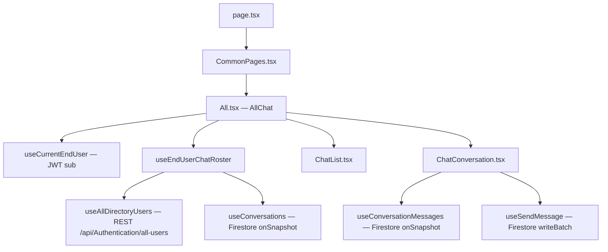

# 💬 EndUser (School Management) — Chat Feature

Real-time, one-to-one messaging built for the web frontend to mirror the **Flutter mobile app** (`lib/features/chat/`).

Both the web and mobile apps connect to **Cloud Firestore** for message transport and derive identity from the backend **JWT**, allowing seamless cross-platform communication between teachers and school staff.

---

## 📁 File Structure

```
src/app/enduser/chat/
├── page.tsx                     # Next.js route entry point (/enduser/chat)
├── components/
│   ├── ChatAvatar.tsx           # Deterministic initial-based avatar matching mobile palette
│   ├── ChatList.tsx             # Left panel: searchable contact & conversation list
│   └── ChatConversation.tsx     # Right panel: message thread & composer
├── hooks/
│   └── index.tsx                # Firestore real-time hooks, REST directory fetch & send batch
├── pages/
│   ├── All.tsx                  # Master responsive chat layout (list ↔ thread)
│   └── CommonPages.tsx          # Tab container wrapper
├── types/
│   └── IChat.ts                 # Data models, ID formulas & doc converters
└── README.md                    # Integration guide & documentation
```

---

## 🔥 Firestore Data Model

The Firestore layout is **identical to the Flutter mobile app**:

```
conversations/{conversationId}               ← one conversation per pair (summary)
conversations/{conversationId}/messages/{id}  ← individual message documents
```

### `conversations/{conversationId}` (Summary)

| Field | Type | Description |
|---|---|---|
| `participantIds` | `string[]` | Sorted array `[idA, idB]` for `array-contains` querying |
| `lastMessage` | `string` | Last sent message snippet |
| `lastSenderId` | `string` | User ID of the last message author |
| `lastMessageAt` | `Timestamp` | Server timestamp of last activity |

*Deterministic ID Formula*:
```typescript
conversationId = `${[idA, idB].sort()[0]}_${[idA, idB].sort()[1]}`
```

### `conversations/{conversationId}/messages/{id}` (Messages)

| Field | Type | Description |
|---|---|---|
| `senderId` | `string` | User ID of the author |
| `text` | `string` | Message body |
| `sentAt` | `Timestamp` | Server timestamp (`null` locally until confirmed by server) |

---

## 🏗️ Architecture & Data Flow



---

## 🎨 Theme & Palette Synchronization

Colors match the mobile Flutter app palette:
- **Accent & Own Message Bubble**: `#5D6AFB`
- **Background**: `#F5F0FF` / `slate-50`
- **Text & Borders**: `#1E293B`, `#64748B`, `#E2E8F0`
- **Avatar Palette**: Deterministic hash into 6 colors:
  `['#6366F1', '#22C55E', '#F97316', '#EC4899', '#A855F7', '#06B6D4']`

---

## ⚙️ Environment Variables

Requires standard Firebase configuration in `.env.local`:

```bash
NEXT_PUBLIC_FIREBASE_API_KEY=your_api_key
NEXT_PUBLIC_FIREBASE_AUTH_DOMAIN=your_project.firebaseapp.com
NEXT_PUBLIC_FIREBASE_PROJECT_ID=elite-space-school
NEXT_PUBLIC_FIREBASE_STORAGE_BUCKET=elite-space-school.appspot.com
NEXT_PUBLIC_FIREBASE_MESSAGING_SENDER_ID=your_sender_id
NEXT_PUBLIC_FIREBASE_APP_ID=your_app_id
```
